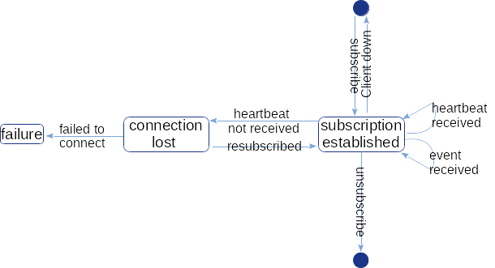
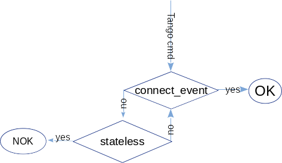

## Preamble

Copyright (c) 2019 Tango Controls

This Specification is free software; you can redistribute it and/or modify it under the terms of the GNU General Public License as published by the Free Software Foundation; either version 3 of the License, or (at your option) any later version. This Specification is distributed in the hope that it will be useful, but WITHOUT ANY WARRANTY; without even the implied warranty of MERCHANTABILITY or FITNESS FOR A PARTICULAR PURPOSE. See the GNU General Public License for more details. You should have received a copy of the GNU General Public License along with this program; if not, see <http://www.gnu.org/licenses>.
x
This Specification is a [free and open standard](http://www.digistan.org/open-standard:definition) and is governed by the Digital Standards
Organization's [Consensus-Oriented Specification System](http://www.digistan.org/spec:1/COSS).

The key words "MUST", "MUST NOT", "REQUIRED", "SHALL", "SHALL NOT", "SHOULD", "SHOULD NOT", "RECOMMENDED", "MAY", and "OPTIONAL" in this document are to be interpreted as described in [RFC 2119](http://tools.ietf.org/html/rfc2119).

## Introduction

This document describes the Tango Publisher-Subscriber protocol. It is a relationship between Tango client (client) and Tango server (server). Based on criteria negotiated as part of a subscription, Tango client will receive updates. Beyond a set of basic requirements, various refinements are addressed. These refinements include: periodicity of updates, filtering out updates based on Tango server configuration and fault tolerance. 

## Basic Concepts

This documents refers to other Tango Controls RFCs, corresponding link is always given in this case. Here is given a brief description of the main concepts. This document targets arbitrary software developer(s) who are to implement *Tango Client Library* and *Tango Server Library*.

*Tango Server* (server) - a process that runs on a machine.

*Tango Device* (device) - a thread within a *Tango Server* that implements *Tango Class* i.e. has *Tango Commands, Attributes, Pipes, Properties*  etc.

*Tango Admin Device* (admin) - a pre-defined *Tango Device* i.e. a *Tango Device* with fixed number *Tango Commands, Attributes, Pipes* [RFC-3, RFC-4,RFC-?]  etc.

For more details see [RFC-2](https://github.com/tango-controls/rfc/tree/draft/2)

*Tango Client* (client) - a process that instantiates communication with *Tango Server* using Request-Reply protocol [RFC-10].

*Tango Client Library* (client kernel library) - library that encapsulates communication with *Tango Server* and provides *Tango Client API* to a user.

*Tango Client API* (client API) - an API that user uses to develop applications based on communication with *Tango Server*s. 

*Tango Server Library* (server kernel library) - library that encapsulates *Tango Server* features and provides *Tango Server API* to a user.

*Tango Server API* (server API) - an API that user uses to develop *Tango Device* functionality.

*Upstream Tango Server/Device* (upstream server) - a *Tango Device* to which updates *client* subscribes for.  

*Polling thread* (polling thread) - a thread within *Tango Server* that polls periodically defined *Tango Device*'s attributes/sometimes commands.

*Tango Publish-Subscriber protocol* (pub-sub) - is a sub-set of *Tango Client-Server protocol* [RFC-?] that defines a relationship between *client* and *server* established via a negotiation phase and lasts till explicitly broken. During this relationship client receives updates published by *upstream server*. Updates are sourced from server's *polling thread* or directly through *server API*. Updates are filtered according to *device*'s configuration.

*Tango Event* (event) - an update sent by *server*.

*Tango Event Callback* (callback) - a piece of code that *client library* executes when an update is received.

## Definitions

This section offers a number of ABNF formal definitions for entities repeatedly used below in this document. 

```ABNF
EVENT_TYPE = "QUALITY_EVENT" | "INTERFACE_CHANGE" | "PIPE" | "ATTR_CONF_EVENT" |  "CHANGE_EVENT" | "PERIODIC_EVENT" | "ARCHIVE_EVENT" | "USER_EVENT" | "HEARTBEAT"

HEARTBEAT_ENDPOINT = "(upstream server FQDN):port"  

EVENT_ENDPOINT = "(upstream server FQDN):port"

HEARTBEAT_CHANNEL = "(upstream admin device FQDN)/heartbeat" 

EVENT_CHANNEL = "(upstream admin device FQDN)/(attr).EVENT_TYPE[_idl5]" 
```

## Runtime requirements

Client and server are up and running. Server is reachable from client i.e. may communicate using Request-Reply protocol [RFC-10]. 

## Publisher-Subscriber protocol



The main goal of the this protocol implementation is to allow client receive events from server:

* Server MUST publish events of EVENT_TYPE

* Server library MUST provide an API to publish events of EVENT_TYPE

* Client SHOULD process events

* Client library SHOULD provide user an API to register user defined event callbacks  

### Negotiation



Negotiation phase implies that client executes admin's EventSubscriptionChange command:

* Admin MUST implement EventSubscriptionChange command: 

```ABNF
EventSubscriptionChange = Tango Command
EventSubscriptionChange_ARGIN-type  = DevVarStringArr 
EventSubscriptionChange_ARGIN-value = "[ (upstream device), (attribute), "subscribe", EVENT_TYPE]"
EventSubscriptionChange_ARGOUT-type = DevLong
EventSubscriptionChange_ARGOUT-value = "(server library release ver)"
```

**NOTE**: Tango Server Library v9.3.3 force client to explicitly call ZmqEventSubscriptionChange to use ZMQ based implementation [RFC-13]: 
 
```ABNF
ZmqEventSubscriptionChange = Tango Command
ZmqEventSubscriptionChangeArgument-type  = DevVarStringArr 
ZmqEventSubscriptionChangeArgument-value = "[ upstream device, attribute, action ("subscribe|unsubscribe"), EVENT_TYPE]"
ZmqEventSubscriptionChangeOutput-type = DevVarLongStringArr
ZmqEventSubscriptionChangeOutput-value = "[(server library release ver), (upstream device idl ver), (zmq_sub_event_hwm), (rate), (ivl), (zmq release ver); (heartbeat_endpoint), (event_endpoint), n*(alternate_heartbeat_endpoint), n*(alternate_event_endpoint),(heartbeat_channel), (event_channel)]"
```

* Client MUST execute admin's EventSubscriptionChange command to establish Publisher-Subscriber relationship

* Client SHOULD establish tcp? connection to heartbeat/event endpoints

* Client MAY iterate over alternative heartbeat/event endpoints to establish connection if above has failed

* Client MAY use provided heartbeat/event channels to identify event source 

### Subscription 

* Server MUST send events via corresponding EVENT_CHANNEL

* Server MUST send HEARTBEAT event every 9 seconds

* Client MUST execute EventConfirmSubscription command every 600 seconds to indicate its interest in subscription

```abnf
EventConfirmSubscription
```  

### Cancel event subscription

* Client MAY cancel its subscription by executing EventSubscriptionChange on upstream admin 

```abnf

EventSubscriptionChange_ARGIN-value = "[ (upstream device), (attribute), "unsubscribe", EVENT_TYPE]"

```

* Server MUST stop to send events to client whose subscription is canceled

### Fault tolerance

Tango Pub-Sub protocol implies a number of fault tolerance techniques:

- server heartbeat
- client subscription confirmation
- events client/server buffer

* Client SHOULD try to re-subscribe once HEARTBEAT event is missing

* Client MAY try to re-subscribe indefinitely

* Server MAY cancel client's subscription if it does not confirm its interest i.e. EventConfirmSubscription was not executed

* Client/Server SHOULD implement (in/out)coming events buffer to prevent overload 

* Client/Server MUST prevent crash in case events overflow