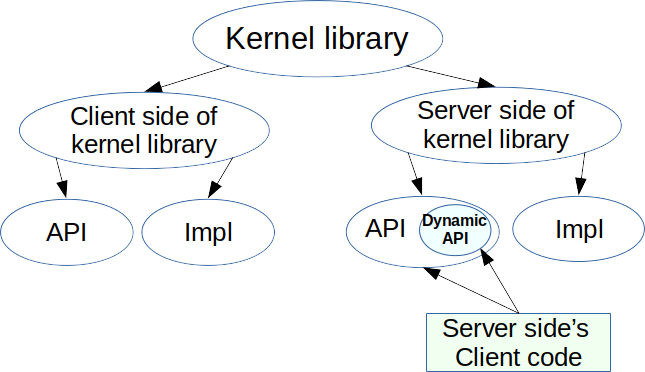

## Preamble

Copyright (c) 2019 Tango Controls

This Specification is free software; you can redistribute it and/or modify it under the terms of the GNU General Public License as published by the Free Software Foundation; either version 3 of the License, or (at your option) any later version. This Specification is distributed in the hope that it will be useful, but WITHOUT ANY WARRANTY; without even the implied warranty of MERCHANTABILITY or FITNESS FOR A PARTICULAR PURPOSE. See the GNU General Public License for more details. You should have received a copy of the GNU General Public License along with this program; if not, see <http://www.gnu.org/licenses>.

This Specification is a [free and open standard](http://www.digistan.org/open-standard:definition) and is governed by the Digital Standards
Organization's [Consensus-Oriented Specification System](http://www.digistan.org/spec:1/COSS).

The key words "MUST", "MUST NOT", "REQUIRED", "SHALL", "SHALL NOT", "SHOULD", "SHOULD NOT", "RECOMMENDED", "MAY", and "OPTIONAL" in this document are to be interpreted as described in [RFC 2119](http://tools.ietf.org/html/rfc2119).

## Goals

This specification describes the Tango kernel dynamic Attribute and Command API. 

## Use Cases

The primary use case is to allow Tango Device Server programmers to create Attributes and/or Commands in runtime.

Reasons for that:
- create Attributes/Commands based on underlying library;
- create generic Tango device classes which interfaces are entirely/partly unknown at the moment of creation.

Consider a Tango device class that represents a serie of detectors. Each detector differs a bit in terms of supported features, while the most part of the code could be the same for each detector. These small differentiations may be implemented as dynamic Attributes or Commands. 

Consider a Tango Device Class that represents a residual gaz analyzer. The device will provide measurement results for many different masses. The results can be presented as a Tango spectrum attribute showing the measurements for all the masses but it can be also very interesting to create an attribute for each different mass, then the user could monitor this specific mass or define some alarm thresholds or configure archiving events for this specific mass. Dynamic attributes may be used to create easily these numerous attributes whose behaviour is almost identical.

Consider a Tango Device my/simu/device simulating the interface of another Tango Device my/original/device, for tests purposes. my/simu/device could query the interface of my/original/device at runtime and create dynamically the same attributes and commands as my/original/device. The simulated device could then be used to test high level client applications which would then talk to the simulated device instead of the original device.

## Definitions

Tango kernel library - library that provides Tango client and server APIs

Tango server client - client code to Tango kernel library's server API

## API that allows to create Attributes and Commands in runtime

Tango kernel library MUST provide API to server client to add new Attributes, Commands.

This API MAY accept configuration for each Attribute or/and Command. 

Accepted configuration MUST be the same as described in RFC-3 (The command model) and RFC-4 (The attribute model)

As the result of the call, API creates corresponding Attribute/Command fully compliant to RFC-4/RFC-3.

Implementation of the API MAY send an Event (INTERFACE_CHANGE, see RFC-12) in response to a new Attribute/Command creation/removal.

> In Tango V10
All Commands and Attributes MUST be defined as dynamic i.e. use this API. High level API MAY provide sense of static entities.   

